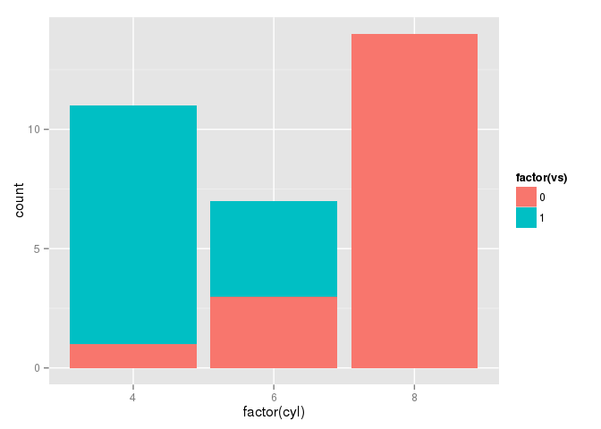
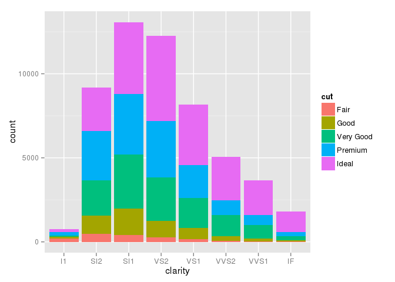

# dreamR_day06_graph
Sejin Park  
2015. 9. 13.  


```r
library(ggplot2)

ggplot() +
  geom_point(data = iris,
             aes(x = Sepal.Length, y=Sepal.Width, colour = Species))
```

 
## 여러개의 레이어를 겹쳐서 그릴 수 있다. 


```r
ggplot() + 
  geom_point(data = iris, aes(x = Sepal.Length, y = Sepal.Width)) +
  geom_smooth(data = iris, aes(x = Sepal.Length, y = Sepal.Width))
```

```
## geom_smooth: method="auto" and size of largest group is <1000, so using loess. Use 'method = x' to change the smoothing method.
```

 


공통적으로 반영되는 요소들은 미리 정의해 둘 수 있다.   
ggplot2의 결과물은 객첼 저장할 수 있다. 


```r
ggplot(data = iris, aes(x= Sepal.Length, y = Sepal.Width)) +
  geom_point() +
  geom_smooth()
```

```
## geom_smooth: method="auto" and size of largest group is <1000, so using loess. Use 'method = x' to change the smoothing method.
```

 

```r
iris_plot = ggplot(data = iris, 
                   aes(x = Sepal.Length, y = Sepal.Width))

iris_plot +
  geom_point() +
  geom_smooth()
```

```
## geom_smooth: method="auto" and size of largest group is <1000, so using loess. Use 'method = x' to change the smoothing method.
```

 


data = diamonds
aes 는 x=carat, y=price일때 
geom_point를 사용해서 산점도(scatter plot) 그리기. 


```r
data = diamonds
head(data)
```

```
##   carat       cut color clarity depth table price    x    y    z
## 1  0.23     Ideal     E     SI2  61.5    55   326 3.95 3.98 2.43
## 2  0.21   Premium     E     SI1  59.8    61   326 3.89 3.84 2.31
## 3  0.23      Good     E     VS1  56.9    65   327 4.05 4.07 2.31
## 4  0.29   Premium     I     VS2  62.4    58   334 4.20 4.23 2.63
## 5  0.31      Good     J     SI2  63.3    58   335 4.34 4.35 2.75
## 6  0.24 Very Good     J    VVS2  62.8    57   336 3.94 3.96 2.48
```

## Parameter


```r
iris_plot +
  geom_point(size = 3, colour = 'red') +
  geom_smooth()
```

```
## geom_smooth: method="auto" and size of largest group is <1000, so using loess. Use 'method = x' to change the smoothing method.
```

 

```r
# parameter 지정 (에스테틱 일괄 지정)
```
사용가능한 에스테틱 확인하기 
?geom_point 

## Parameter

```r
iris_plot + 
  geom_point(size = 3, colour = 'red') +
  geom_smooth(method = 'lm')
```

 


```r
# 선의 모양 변경 
iris_plot +
  geom_point(size =3 , colour = 'red') +
  geom_smooth(linetype = 2)
```

```
## geom_smooth: method="auto" and size of largest group is <1000, so using loess. Use 'method = x' to change the smoothing method.
```

 

```r
# standard error 의 범위를 표현하지 않는다. 
iris_plot + 
  geom_point(size = 3, colour = 'red') +
  geom_smooth(se= FALSE)
```

```
## geom_smooth: method="auto" and size of largest group is <1000, so using loess. Use 'method = x' to change the smoothing method.
```

 

data = iris
aes는 x=Species , y= Sepal.Width 일 때, 
geom_boxplot를 사용해서 boxplot 그리기
면의 색상(fill)은 #3399ff
선의 색상(colour 또는 color)은 #c8b923


```r
iris_plot = ggplot(data = iris, 
          aes(x = Species, y = Sepal.Width))


iris_plot + 
  geom_boxplot(fill='#3399FF', colour='#C8B923')
```

 

```r
iris_plot + 
  geom_boxplot(fill='#3399FF', colour='blue')
```

 

## Position Adjustment


```r
ggplot(data = mpg, aes(displ, hwy)) +
  geom_point(position = "jitter") + 
  geom_smooth()
```

```
## geom_smooth: method="auto" and size of largest group is <1000, so using loess. Use 'method = x' to change the smoothing method.
```

 

```r
# 누적 막대그래프 

ggplot(mtcars,
  aes(factor(cyl), fill = factor(vs)))+
  geom_bar(position = "stack")
```

 

```r
ggplot(mtcars,
  aes(factor(cyl), fill = factor(vs)))+
  geom_bar(position = "fill")
```

 

```r
ggplot(mtcars,
  aes(factor(cyl), fill = factor(vs)))+
  geom_bar(position = "dodge")
```

 

data = diamonds
aes는 x=clarity, fill=cut일 때 
geom_bar를 사용해서 누적 막대 그래프 그리기. 


```r
head(diamonds, 10)
```

```
##    carat       cut color clarity depth table price    x    y    z
## 1   0.23     Ideal     E     SI2  61.5    55   326 3.95 3.98 2.43
## 2   0.21   Premium     E     SI1  59.8    61   326 3.89 3.84 2.31
## 3   0.23      Good     E     VS1  56.9    65   327 4.05 4.07 2.31
## 4   0.29   Premium     I     VS2  62.4    58   334 4.20 4.23 2.63
## 5   0.31      Good     J     SI2  63.3    58   335 4.34 4.35 2.75
## 6   0.24 Very Good     J    VVS2  62.8    57   336 3.94 3.96 2.48
## 7   0.24 Very Good     I    VVS1  62.3    57   336 3.95 3.98 2.47
## 8   0.26 Very Good     H     SI1  61.9    55   337 4.07 4.11 2.53
## 9   0.22      Fair     E     VS2  65.1    61   337 3.87 3.78 2.49
## 10  0.23 Very Good     H     VS1  59.4    61   338 4.00 4.05 2.39
```

```r
ggplot(diamonds, 
    aes(x=clarity, fill=cut))+ 
    geom_bar(position="stack")
```

 


```r
dia_bar <- ggplot(diamonds, aes(x=cut, fill=cut)) + geom_bar()
dia_bar + scale_fill_brewer()
```

 


```r
dia_bar + 
  scale_fill_brewer(palette = 'Paired')
```

 

```r
dia_bar + 
  scale_fill_brewer(palette = 'Accent')
```

 
